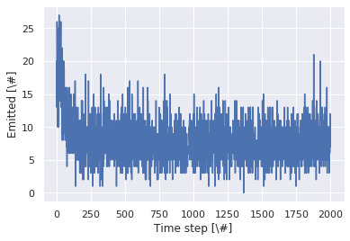
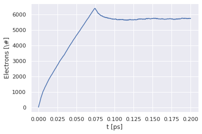
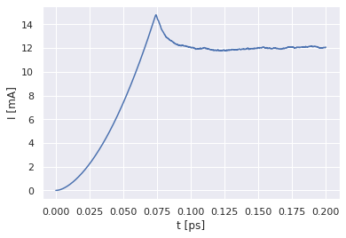
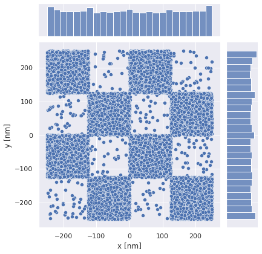
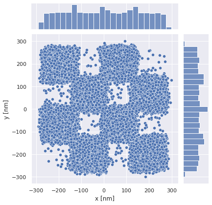
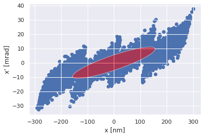

Data analysis examples
======================

The example directory contains a number of examples with Python Jupiter notebooks that show data analysis.
The output of the example notebook for the thermal-field emission example is shown below.

Checkerboard
============

Thermal field emission
----------------------

.. code:: ipython3

    import numpy as np
    import pandas as pd
    
    import matplotlib
    import matplotlib.pyplot as plt
    from matplotlib.patches import Ellipse
    %matplotlib inline
    import seaborn as sns
    sns.set_theme()
    
    import os.path as path
    import f90nml
    
    # Path to simulations
    filepath = './'

Read input parameters
---------------------

.. code:: ipython3

    # input file
    filename_input = path.join(filepath, 'input')
    
    # Read the input file for parameters used
    input_nml = f90nml.read(filename_input)
    
    # Read the init.bin file for system parameters
    #epsilon_r, m_eeff, m_heff, length_scale, time_scale, vel_scale, cur_scale, MAX_PARTICLES, MAX_EMITTERS, MAX_SECTIONS, MAX_LIFE_TIME
    dt_sys = np.dtype([('epsilon_r', np.float64), \
                       ('m_eeff', np.float64), \
                       ('m_heff', np.float64), \
                       ('length_scale', np.float64), \
                       ('time_scale', np.float64), \
                       ('vel_scale', np.float64), \
                       ('cur_scale', np.float64), \
                       ('MAX_PARTICLES', np.int32), \
                       ('MAX_EMITTERS', np.int32), \
                       ('MAX_SECTIONS', np.int32), \
                       ('MAX_LIFE_TIME', np.int32) ])
    filename_initbin = path.join(filepath, 'out/init.bin')
    data_sys = np.memmap(filename_initbin, dtype=dt_sys, mode='r', order='F')
    input_nml['system'] = dict(zip(data_sys.dtype.names, data_sys[0]))
    
    # Print input parameters
    print(input_nml)

.. parsed-literal::

    &input
        v_s = 2000.0
        box_dim = 0.0, 0.0, 1000.0
        time_step = 0.0001
        steps = 2000
        emission_mode = 9
        nremit = 1
        image_charge = .true.
        n_ic_max = 1
        collisions = .false.
        t_temp = 293.15
        p_abs = 1.0
        emitters_dim(1:3,1) = 500.0, 500.0, 0.0
        emitters_pos(1:3,1) = -250.0, -250.0, 0.0
        emitters_type(1) = 2
        emitters_delay(1) = 0
    /
    
    &system
        max_emitters = 1
        max_life_time = 1000
        max_particles = 500000
        max_sections = 9216
        cur_scale = 1.0
        epsilon_r = 1.0
        length_scale = 1e-09
        m_eeff = 1.0
        m_heff = 1.0
        time_scale = 1e-12
        vel_scale = 1000.0000000000001
    /

Emission information
~~~~~~~~~~~~~~~~~~~~

.. code:: ipython3

    # Emission file
    filename_emit = path.join(filepath, 'out/emitted.dt')
    
    # Read data into a pandas dataframe
    df_emit = pd.read_csv(filepath_or_buffer=filename_emit, index_col=1, delim_whitespace=True, \
                          header=None, names=['time', 'step', 'nrEmit', 'nrElec', 'nrEmit1'])
    
    # Plot number of particles emitted per time step
    plt.plot(df_emit['nrEmit'].to_numpy())
    plt.xlabel('Time step [\#]')
    plt.ylabel('Emitted [\#]')
    plt.show()
    
    # Plot total number of particles in the system as a function of time
    plt.plot(df_emit['time'].to_numpy(), df_emit['nrElec'].to_numpy())
    plt.xlabel('t [ps]')
    plt.ylabel('Electrons [\#]')
    plt.show()

Current
-------

Read ramo current and plot

.. code:: ipython3

    # Ramo current
    filename_ramo = path.join(filepath, 'out/ramo_current.dt')
    
    # Read the data into a pandas dataframe
    #cur_time, step, ramo_cur, V_d, nrPart, nrElec, nrHole
    df_cur = pd.read_csv(filepath_or_buffer=filename_ramo, index_col=1, delim_whitespace=True, \
                         header=None, names=['time', 'step', 'current', 'volt', 'nrPart', 'nrElec', 'nrHole', 'avg_mob', 'avg_speed', 'ramo_1', 'ramo_2'])
    
    # Plot current in mA as a function of time in ps
    plt.plot(df_cur['time'].to_numpy(), df_cur['current'].to_numpy()/1.0E-3)
    plt.xlabel('t [ps]')
    plt.ylabel('I [mA]')
    plt.show()

Density
-------

Plot emission density
~~~~~~~~~~~~~~~~~~~~~

.. code:: ipython3

    filename_emit_den = path.join(filepath, 'out/density_emit.bin')
    
    # Binary file layout
    # float64 (double precision numbers)
    # int32 (32bit integers)
    dt_emit_type = np.dtype([('x', np.float64), ('y', np.float64), ('emit', np.int32), ('sec', np.int32), ('id', np.int32)])
    
    # Memory map the file
    # mode=r (Read only)
    # order=F (Fortran style array)
    data_mem_emit = np.memmap(filename_emit_den, dtype=dt_emit_type, mode='r', order='F')
        
    # Read the data into dataframe
    df_emit = pd.DataFrame.from_records(data=data_mem_emit, columns=data_mem_emit.dtype.names)
    
    g = sns.jointplot(data=df_emit, x="x", y="y")
    g.set_axis_labels("x [nm]", "y [nm]")

.. parsed-literal::

    <seaborn.axisgrid.JointGrid at 0x7fdd49645760>

Plot absorption density
~~~~~~~~~~~~~~~~~~~~~~~

.. code:: ipython3

    filename_abs = path.join(filepath, 'out/density_absorb_top.bin')
    
    # Binary file layout
    # float64 (double precision numbers)
    # int32 (32bit integers)
    dt_abs_type = np.dtype([('x', np.float64), ('y', np.float64), ('vx', np.float64), ('vy', np.float64), ('vz', np.float64), ('emit', np.int32), ('sec', np.int32),  ('id', np.int32)])
    
    # Memory map the file
    # mode=r (Read only)
    # order=F (Fortran style array)
    data_mem_abs = np.memmap(filename_abs, dtype=dt_abs_type, mode='r', order='F')
        
    # Read the data into dataframe
    df_abs = pd.DataFrame.from_records(data=data_mem_abs, columns=data_mem_abs.dtype.names)
    
    h = sns.jointplot(data=df_abs, x="x", y="y")
    h.set_axis_labels("x [nm]", "y [nm]")

.. parsed-literal::

    <seaborn.axisgrid.JointGrid at 0x7fdd496452e0>

Emittance data
~~~~~~~~~~~~~~

Calculates the emittance
========================

Input is a pandas dataframe that has columns called x and x’.

It returns the Emittance, sigma_w, sigma_wp and theta. \* emittance
[units of x \* x’] [nm-mrad] \* sigma_w is the semi-major axis of the
ellipse [units of x] \* sigma_wp is the semi-minor axis of the ellipse
[units of x’] \* theta is the rotation of the ellipse [deg]

| See http://uspas.fnal.gov/materials/10MIT/Emittance.pdf or J. Buon,
  “Beam phase space and emittance”.
| See also USPAS notes Barletta, Spentzouris, Harms
| https://uspas.fnal.gov/materials/10MIT/MIT-Fund.shtml
| https://uspas.fnal.gov/materials/10MIT/Emittance.pdf

.. code:: ipython3

    def Calc_Emittance(df_emitt, x, xp):
        sigma_x = df_emitt[x].std(ddof=0) # \sigma_x, ddof=0 means use N as normalization
        sigma_xp = df_emitt[xp].std(ddof=0) # \sigma_{x^\prime}
        cov_xxp = df_emitt.cov()[x][xp] # \sigma_x\sigma_{x^\prime}
        N = df_emitt[x].count()
        cov_xxp = cov_xxp*(N-1)/N # Use N as normalization, Pandas uses N-1
        r = df_emitt.corr(method='pearson')[x][xp]
        
        #emittance = sigma_x*sigma_xp*np.sqrt(1.0-r**2)
        emittance = np.sqrt(sigma_x**2*sigma_xp**2 - cov_xxp**2)
        
        sigma_w  = np.sqrt( 0.5*(sigma_x**2 + sigma_xp**2 + np.sqrt( (sigma_x**2 - sigma_xp**2)**2 + (2.0*cov_xxp)**2 )) )
        sigma_wp = np.sqrt( 0.5*(sigma_x**2 + sigma_xp**2 - np.sqrt( (sigma_x**2 - sigma_xp**2)**2 + (2.0*cov_xxp)**2 )) )
        
        theta = 0.5*np.arctan2(2.0*cov_xxp, (sigma_x**2 - sigma_xp**2)) # in rad
        theta = theta * 180/np.pi # Convert from rad to deg
        
        #emittance = sigma_w*sigma_wp
        
        return emittance, sigma_w, sigma_wp, theta

.. code:: ipython3

    df_abs['v'] = np.sqrt(df_abs['vx']**2 + df_abs['vy']**2 + df_abs['vz']**2)
    
    df_abs["x'"] = (df_abs['vx']/df_abs['vz'])/1.0E-3
    df_abs['x'] = df_abs['x']
    
    df_abs["y'"] = (df_abs['vy']/df_abs['vz'])/1.0E-3
    df_abs['y'] = df_abs['y']
    e_x, sw, swp, th = Calc_Emittance(df_abs, "x", "x'")
    e_y, _, _, _ = Calc_Emittance(df_abs, "y", "y'")
    emittance = (e_x + e_y)/2
    sigma_w = sw
    sigma_wp = swp
    theta_ell = th
    
    # Plot x and x'
    ell_0 = Ellipse([0.0, 0.0], 2.0*sigma_w, 2.0*sigma_wp, theta_ell, zorder=1)
    ax = plt.subplot(111)
    ax.plot(df_abs['x'].to_numpy(), df_abs["x'"].to_numpy(), 'o', zorder=0)
    plt.xlabel('x [nm]')
    plt.ylabel("x' [mrad]")
    ax.add_artist(ell_0)
    ell_0.set_facecolor('red')
    ell_0.set_alpha(0.5)
    plt.show()

.. index:: python, data analysis, Jupiter notebook, examples